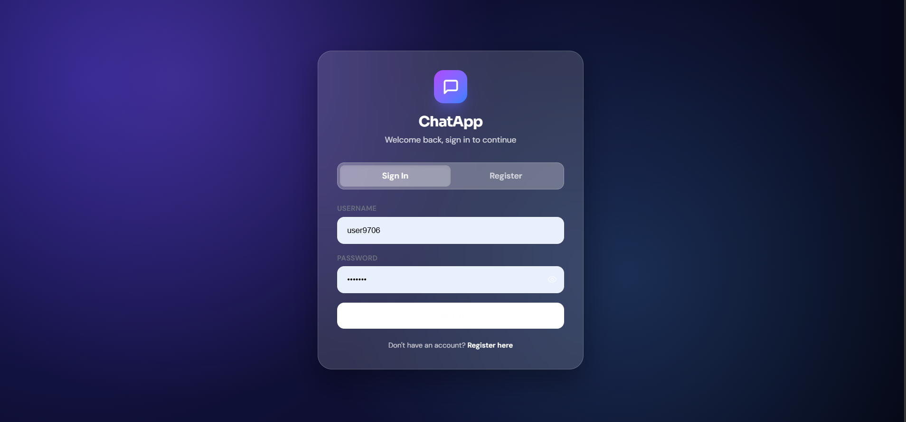
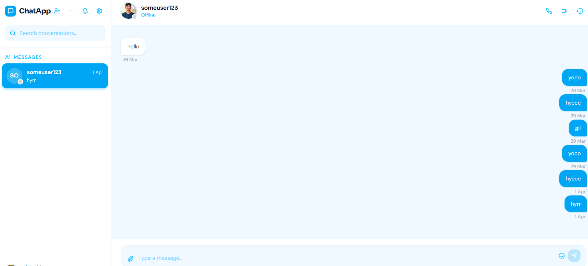

# 💬 Real-Time Chat Application

A modern **full‑stack real‑time chat application** built using modern
web technologies.\
It supports **one‑to‑one messaging, group chats, authentication, and
real‑time communication using WebSockets**.

This project demonstrates how to build scalable chat systems using
**React, Node.js, Express, MongoDB, and Socket.IO**.

---

## 🚀 Features

- ⚡ Real‑time messaging with Socket.IO
- 👤 User authentication (JWT)
- 💬 One‑to‑one chat
- 👥 Group chat support
- 📡 Instant message updates
- 📎 Attachment support
- 🟢 Online / Offline user presence
- ⚡ Optimistic UI updates
- 📱 Responsive UI

---

## 🛠️ Tech Stack

### Frontend

- React.js
- Vite
- Tailwind CSS
- Axios
- Socket.IO Client

### Backend

- Node.js
- Express.js
- Socket.IO

### Database

- MongoDB
- Mongoose

### Authentication

- JSON Web Tokens (JWT)

### Dev Tools

- Git
- GitHub
- Postman
- Docker (optional)

---

## 📂 Project Structure

    Chat-App
    │
    ├── client/              # Frontend (React)
    │   ├── components/
    │   ├── pages/
    │   ├── hooks/
    │   └── utils/
    │
    ├── server/              # Backend API
    │   ├── controllers/
    │   ├── models/
    │   ├── routes/
    │   ├── middlewares/
    │   └── socket/
    │
    └── README.md

---

## ⚙️ Installation & Setup

### 1. Clone the repository

    git clone https://github.com/nitin9706/Chat-App.git
    cd Chat-App

### 2. Install dependencies

#### Backend

    cd server
    npm install

#### Frontend

    cd client
    npm install

---

### 3. Setup Environment Variables

Create a `.env` file inside the **server** directory.

    PORT=3000
    MONGO_URI=your_mongodb_connection
    JWT_SECRET=your_secret
    CLIENT_URL=http://localhost:5173

---

### 4. Run the Application

#### Start Backend

    cd server
    npm run dev

#### Start Frontend

    cd client
    npm run dev

---

## 🌐 Open in Browser

    http://localhost:5173

---

## 🔌 Example API Endpoints

Method Endpoint Description

---

POST /api/auth/login Login user
POST /api/auth/register Register user
GET /api/chats Fetch user chats
POST /api/messages Send message
GET /api/messages/:chatId Get messages for a chat

---

## 📸 Screenshots

### Login Page

### Chat Interface

<!-- ### Group Chat

 -->

  
  

## 🔄 Real‑Time Communication

Socket.IO is used for:

- Instant message delivery
- Live chat updates
- Online user tracking
- Broadcasting messages to chat participants

---

## 📈 Future Improvements

- Message reactions
- Voice messages
- Video / voice calls
- Push notifications
- Message editing & deleting
- End‑to‑end encryption

---

## 👨‍💻 Author

**Nitin Sharma**

GitHub: https://github.com/nitin9706

---

## ⭐ Support

If you like this project:

- ⭐ Star the repository
- 🍴 Fork the project
- 📢 Share it with others

---

## 📜 License

This project is licensed under the **MIT License**.
